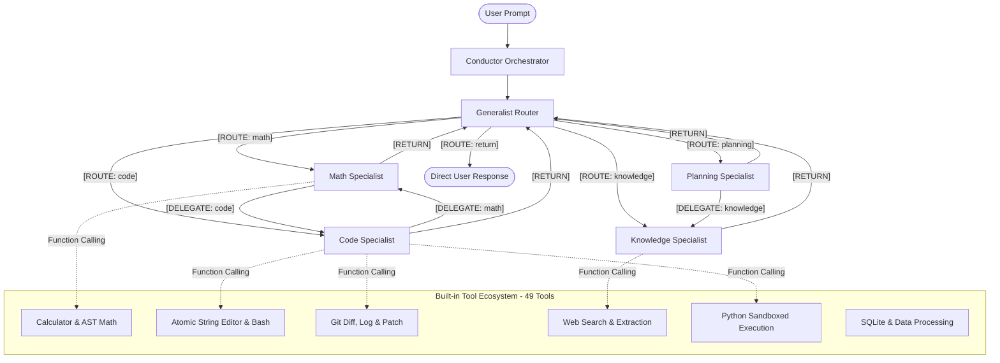

# OpenJarvis CLI

> **The Vendor-Agnostic, Multi-Model Agentic Orchestration CLI & Terminal Client** — *v{{ version }}*

**OpenJarvis** routes complex natural language tasks across a team of specialized language models orchestrated over a deterministic **LangGraph state machine**. Instead of relying on a single monolithic model to handle coding, heavy mathematics, factual research, and planning simultaneously, OpenJarvis routes each component of your conversation to dedicated domain specialists and provides **49 production-grade built-in tools** with fine-grained access control and real-time execution.

---

## Why OpenJarvis?

Traditional AI assistants force one model to be a "jack of all trades, master of none." This leads to hallucinations in arithmetic, syntax errors in complex software, runaway token costs, and sluggish performance. 

OpenJarvis introduces **heterogeneous specialist orchestration**:



---

## Core Architecture & Key Features

### 1. LangGraph State Machine & Deterministic Routing
- **Cyclic Agent Graph**: OpenJarvis models the conversation as a directed state machine using LangGraph. Agents transition deterministically between roles, execute tool calls, and hand off intermediate artifacts.
- **Hop Limits & Loop Detection**: Enforces a strict `max_hops` cap (default: `10`) to eliminate infinite ping-pong delegation loops. If an agent loops back or hits the hop limit, the Conductor intercepts execution and forces a synthesized response rather than crashing.
- **Streaming Tag Suppression**: Streams tokens in real time to your terminal while withholding routing protocol tags (`[ROUTE: ...]`, `[RETURN]`, `[DELEGATE: ...]`) so your output remains clean and distraction-free.

---

### 2. Declarative Specialists & Harness Prompt Templating
- **Clean Configuration**: You define *what* a specialist does and *who* it can delegate to in simple YAML. You never have to manually write routing syntax or protocol instructions in your system prompts.
- **Dynamic Routing Injection**: The Conductor automatically constructs the complete system prompt at runtime, injecting:
  - The live directory of available specialists and domain summaries.
  - The exact delegation boundaries specified in `delegates_to`.
  - Standardized completion protocols (`[RETURN]`).

```yaml
specialists:
  math:
    name: "math"
    description: "Arithmetic, calculus, equations, statistics, and proofs."
    system_prompt: |
      You are the MATH specialist. Solve mathematics and quantitative problems with rigor.
    delegates_to: ["code"]
    tools: ["calculator", "evaluate_expression", "solve_linear_equation"]
```

---

### 3. Fine-Grained Tool Permissions & Scoped Tool RAG
- **Per-Specialist Tool Allowlist**: Configure exactly which tools each specialist can see and execute via `tools: [...]`.
- **Pure Reasoning Agents**: Assign `tools: []` to create pure reasoning specialists (such as creative writers or high-level planners) that cannot invoke tools, eliminating tool hallucination risks.
- **Scoped Two-Phase Tool Retrieval**: When Tool RAG is enabled, semantic vector similarity search (*FastEmbed*) and always-on tool injection operate **strictly within the specialist's permitted tool subset**. Unpermitted tools are never indexed, retrieved, or bound.
- **Defense-in-Depth Execution Guard**: If an LLM attempts to call an unpermitted tool, OpenJarvis intercepts the call at runtime and blocks execution with an explicit security event.

---

### 4. 49 Production-Grade Built-In Tools Across 9 Modules
OpenJarvis adheres to a strict **No Demos, No Mocks Policy**. Every tool performs real computation and returns actionable feedback:

| Category | Tools | Highlight Capabilities |
| :--- | :---: | :--- |
| **[File Operations](tools/files.md)** | 9 | Atomic file reading/writing, recursive tree walk, regex search, glob search, file deletion |
| **[Git & Version Control](tools/git.md)** | 4 | Unified git diff inspection, status summary, commit log history, patch application |
| **[Web & Research](tools/web.md)** | 5 | DuckDuckGo search, HTML text extraction, Wikipedia API queries, REST HTTP client |
| **[Code Execution](tools/code.md)** | 4 | Sandboxed Python runner, shell command execution, Python syntax linting, pytest runner |
| **[Editor & Terminal](tools/editor.md)** | 3 | Atomic `str_replace_editor` with line-level viewing, insertion, and replacement; bash execution |
| **[Data Processing](tools/data.md)** | 6 | JSON pretty-printing, jq filtering, CSV formatting, regex match/replace, SQLite querying |
| **[Math & Arithmetic](tools/math.md)** | 4 | AST-based expression evaluation, algebraic equation solving, unit conversion, statistics |
| **[Date & Time](tools/datetime.md)** | 4 | Current timestamps, timezone conversion, date delta calculations, business day counting |
| **[Session Memory](tools/memory.md)** | 10 | Persistent note storage, semantic memory retrieval, session state management |

---

### 5. Multi-Tiered Safety & Security
- **Three Operational Modes**:
  - `interactive`: Prompts user confirmation in the terminal before executing potentially destructive tools.
  - `allowlist`: Automatically allows safe pre-approved tools while rejecting blocked actions.
  - `autonomous`: Executes approved tools seamlessly within configured workspace boundaries.
- **On-Device Safety Classifier**: A lightweight neural classifier inspects tool commands and parameters to detect dangerous patterns (e.g. destructive disk commands, arbitrary shell execution, sensitive path traversal).

---

### 6. Universal Provider Freedom (Pure Python)
- **Zero GPU / CUDA Overhead**: Written in pure Python (Python 3.13 / 3.14). Operates cleanly on lightweight laptops, servers, or cloud containers without importing `torch` or `transformers`.
- **Mix & Match Providers**: Mix local and cloud providers in the exact same session:
  - **Local & Offline**: Ollama, vLLM, llama.cpp, LocalAI.
  - **Cloud Providers**: OpenAI, Anthropic, Google Gemini, Groq, OpenRouter, Mistral, DeepSeek.

---

### 7. Interactive Terminal REPL & Workspace Awareness
- **Visual Routing Tracer**: Real-time terminal feedback displaying model hops, tool calls, and intermediate results with distinct formatting.
- **Workspace Discovery**: Automatically discovers project-local `.openjarvis/` configurations, instructions, and context files to tailor agent behaviors to your active repository.
- **Interactive Setup Wizard**: Run `openjarvis` with no prior configuration, and the built-in wizard guides you through selecting providers, models, and tool configurations in seconds.

---

## Live Terminal Walkthrough

```text
$ openjarvis

oj> Calculate the compounded return of $5,000 at 7% over 5 years, then write a Python script to plot it.

  ↳ [routing] generalist → math
  ⚙ [tool] evaluate_expression {"expression": "5000 * (1 + 0.07)**5"}
    → 7012.75865
  ↳ [delegation] math → code

The investment will grow to **$7,012.76** after 5 years.

Here is a Python script using matplotlib to visualize the annual growth trajectory:

```python
import matplotlib.pyplot as plt

principal = 5000
rate = 0.07
years = list(range(6))
balances = [principal * ((1 + rate) ** y) for y in years]

plt.figure(figsize=(8, 4))
plt.plot(years, balances, marker="o", color="#4CAF50", linewidth=2)
plt.title("Compound Growth ($5,000 at 7% Annually)")
plt.xlabel("Years")
plt.ylabel("Balance ($)")
plt.grid(True, linestyle="--", alpha=0.6)
plt.tight_layout()
plt.show()
```
```

---

## Feature Comparison Matrix

| Capability | OpenJarvis CLI | Standard Single-Model CLI | Heavy Agent Frameworks |
| :--- | :---: | :---: | :---: |
| **Multi-Model Routing** | ✅ Deterministic LangGraph | ❌ Single model only | ⚠️ Custom code required |
| **Mix Local & Cloud Models** | ✅ Per-specialist provider | ❌ No | ⚠️ Complex manual wiring |
| **Declarative System Prompts** | ✅ Auto harness templated | ❌ Manual prompt hacks | ❌ Complex prompt code |
| **Fine-Grained Tool Scoping** | ✅ Per-specialist allowlist | ❌ All or nothing | ⚠️ Difficult state management |
| **Scoped Tool RAG** | ✅ FastEmbed scoped search | ❌ Unscoped or none | ⚠️ Heavy vector DB setup |
| **Infinite Loop Protection** | ✅ Hard hop cap + cycle detect | ❌ N/A | ⚠️ Often hangs or burns tokens |
| **Pure Python Architecture** | ✅ Zero torch/CUDA footprint | ✅ Varies | ❌ Heavy GPU dependencies |
| **Built-in Production Tools** | ✅ 49 verified tools | ⚠️ 0–5 basic tools | ⚠️ Many mock/demo tools |
| **Single Standalone Binary** | ✅ PyInstaller executable | ⚠️ Rare | ❌ Not practical |

---

## Getting Started

=== "Standalone Binary (Recommended)"
    Download the pre-compiled standalone executable for your operating system from the [GitHub Releases](https://github.com/bhanuponguru/openjarvis-cli/releases) page:
    ```bash
    # Extract and run (zero Python runtime required)
    tar xzf openjarvis-v{{ version }}-linux-x86_64.tar.gz
    cd openjarvis-*
    chmod +x openjarvis
    ./openjarvis
    ```

=== "From Source"
    Clone the repository and run directly with `uv`:
    ```bash
    git clone https://github.com/bhanuponguru/openjarvis-cli.git
    cd openjarvis-cli
    uv sync
    uv run openjarvis
    ```

---

## Documentation Navigation

- 🚀 **[Installation Guide →](getting-started/installation.md)**: Install via package managers or compiled standalone binaries.
- ⚡ **[Quick Start Guide →](getting-started/quick-start.md)**: Walk through the first-run wizard and prompt execution.
- ⚙️ **[Configuration Overview →](configuration/overview.md)**: Complete reference for `specialists.yaml`.
- 👥 **[Specialists & Routing →](configuration/specialists.md)**: Master domain boundaries, delegation, and tool assignment.
- 🛠️ **[Built-in Tools Manual →](tools/overview.md)**: Deep dive into all 49 tools across 9 modules.
- 🔒 **[Security & Safety Model →](security.md)**: Safety classifier, permissions manager, and sandboxing.
- 💻 **[CLI & REPL Reference →](usage/cli.md)**: Command flags, terminal keybindings, and session management.
