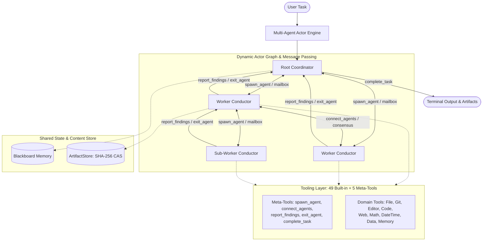

# OpenJarvis CLI

> **Autonomous Multi-Agent Orchestration CLI & Terminal Client** — *v{{ version }}*

OpenJarvis CLI is an open-source, vendor-agnostic agentic orchestration engine and interactive terminal client. It executes complex tasks across a dynamic Multi-Agent System (MAS) of autonomous Conductor nodes coordinated via an asynchronous actor engine, strictly enforced bottom-up exit hierarchy, neighbor-based consensus, and content-addressable artifact storage.

---

## Architecture Overview

OpenJarvis models agent orchestration as a directed graph of asynchronous actor nodes communicating through typed envelopes:



---

## Technical Specifications

### 1. Asynchronous Actor Engine & Lifecycle
- **Actor Concurrency**: Every active agent runs as an isolated `AgentNode` with a dedicated `AgentMailbox` processing typed message `Envelope` instances (`task_assignment`, `peer_message`, `consensus_request`, `consensus_vote`, `shutdown`).
- **Dynamic Topology**: Agents dynamically instantiate child conductors via `spawn_agent`, link peer communication channels via `connect_agents`, exchange intermediate results via `report_findings`, terminate via `exit_agent`, and resolve root execution via `complete_task`.
- **Bottom-Up Exit Hierarchy**: A parent agent cannot exit until all child agents have reached a terminal state (`exit_agent`). The engine rejects unauthorized parent termination attempts and maintains graph invariants.
- **Neighbor Consensus**: Agents broadcast proposals to adjacent graph neighbors, evaluate incoming proposals against local state, and aggregate quorum before committing shared blackboard mutations.

---

### 2. Content-Addressable Artifact Management
- **SHA-256 Storage Engine**: Large text blobs, source files, and binary assets are ingested into `ArtifactStore`, indexed by content hash.
- **Deduplication & Provenance**: Agents pass lightweight immutable hash pointers through mailbox envelopes rather than serializing entire payloads, preventing context-window exhaustion and race conditions.
- **Session Blackboard**: Shared key-value blackboard with atomic key locks and version tags for intermediate multi-agent state sharing.

---

### 3. Declarative Agents & Configuration
- **Configuration Hierarchy**: Global defaults in `~/.openjarvis/config.yaml` overridden by workspace-level `.openjarvis/config.yaml` or explicit `--config <path>`.
- **Role Scoping**: Define specialized agent profiles with custom model providers, system prompts, temperature, and permitted tool subsets.
- **Role Alias Resolution**: Built-in aliases resolve seamlessly to canonical profiles (e.g. `code` -> `coder`, `research` -> `researcher`).

```yaml
# .openjarvis/config.yaml
version: "0.3.0"

default_provider: "openai"
default_model: "gpt-4o"

root_agent:
  role: "coordinator"
  model: "gpt-4o"
  temperature: 0.1
  tools:
    - spawn_agent
    - connect_agents
    - report_findings
    - exit_agent
    - complete_task
    - read_file
    - search_dir

agents:
  coder:
    model: "claude-3-5-sonnet-20241022"
    provider: "anthropic"
    temperature: 0.2
    tools:
      - str_replace_editor
      - bash
      - run_python
      - run_pytest
      - search_in_files

  researcher:
    model: "gemini-2.0-flash"
    provider: "gemini"
    temperature: 0.2
    tools:
      - search_web
      - fetch_url
      - read_file
```

---

### 4. Built-in Tool Ecosystem
The platform includes 49 deterministic built-in tools across 9 functional categories, plus 5 engine coordination meta-tools:

| Category | Count | Primary Tools |
| :--- | :---: | :--- |
| **Meta-Tools** | 5 | `spawn_agent`, `connect_agents`, `report_findings`, `exit_agent`, `complete_task` |
| **[Editor & Terminal](tools/editor.md)** | 3 | `str_replace_editor`, `execute_bash`, `bash` |
| **[File Operations](tools/files.md)** | 9 | `read_file`, `write_file`, `list_directory`, `search_in_files`, `search_dir`, `search_file`, `find_file`, `file_info`, `delete_file` |
| **[Git & VCS](tools/git.md)** | 4 | `git_status`, `git_diff`, `git_log`, `apply_patch` |
| **[Web & Network](tools/web.md)** | 5 | `search_web`, `fetch_url`, `fetch_wikipedia`, `http_request`, `parse_openapi_spec` |
| **[Code Execution](tools/code.md)** | 4 | `run_python`, `run_shell`, `lint_python`, `run_pytest` |
| **[Data Processing](tools/data.md)** | 6 | `parse_json`, `jq_query`, `parse_csv`, `regex_search`, `regex_replace`, `sql_query` |
| **[Math & Arithmetic](tools/math.md)** | 4 | `evaluate_expression`, `solve_equation`, `convert_units`, `prime_factorize` |
| **[Date & Time](tools/datetime.md)** | 4 | `get_current_datetime`, `date_arithmetic`, `format_datetime`, `days_between` |
| **[Session Memory](tools/memory.md)** | 10 | `save_memory`, `read_memory`, `update_memory`, `delete_memory`, `list_memories`, `search_memories`, plus note aliases |

---

### 5. Execution Security & Permissions
- **Permission Modes**:
  - `interactive`: Prompts user confirmation in the terminal before executing unapproved tools.
  - `autonomous`: Auto-approves tool execution, subject to argument pattern rules and safety classifier checks.
  - `allowlist`: Enforces strict allowlist membership; prompts confirmation for unlisted tools.
- **Rule Matching**: Glob-based argument pattern filtering (`fnmatch`) supporting granular `allow`, `deny`, or `confirm` policies per tool argument.
- **Meta-Tool Exemption**: Engine coordination meta-tools are classified as internal primitives and bypass interactive confirmation prompts.

---

### 6. Provider Agnostic Architecture
- **Pure Python**: Implemented in Python 3.13 / 3.14 without GPU or PyTorch dependencies.
- **Universal Provider Support**: Connects to OpenAI, Anthropic, Google Gemini, Ollama, vLLM, and any OpenAI-compatible HTTP endpoint.

---

## Live Terminal Output

```text
$ openjarvis

oj> Calculate the compounded return of $5,000 at 7% over 5 years, then write a Python script to plot it.

  [root] ⚙ spawn_agent {"role": "math", "task": "Calculate compounded return of $5000 at 7% for 5 years"}
    → Agent 'agent-math' spawned
  [agent-math] ⚙ evaluate_expression {"expression": "5000 * (1 + 0.07)**5"}
    → 7012.75865
  [agent-math] ⚙ report_findings {"recipient": "root", "findings": "Principal $5000 at 7% over 5 years yields $7,012.76"}
    → Findings delivered to 'root'
  [agent-math] ⚙ exit_agent {"status": "success"}
    → Agent 'agent-math' terminated
  [root] ⚙ spawn_agent {"role": "coder", "task": "Generate a script using matplotlib to plot compounded return trajectory"}
    → Agent 'agent-coder' spawned
  [agent-coder] ⚙ write_file {"file_path": "plot_growth.py", "content": "..."}
    → File 'plot_growth.py' written (248 bytes)
  [agent-coder] ⚙ report_findings {"recipient": "root", "findings": "Plot script saved to plot_growth.py"}
    → Findings delivered to 'root'
  [agent-coder] ⚙ exit_agent {"status": "success"}
    → Agent 'agent-coder' terminated
  [root] ⚙ complete_task {"summary": "Completed calculation ($7,012.76) and generated plot script at plot_growth.py"}

The investment will grow to **$7,012.76** after 5 years.
The visualization script has been written to `plot_growth.py`.
```

---

## Getting Started

=== "Standalone Binary"
    Download the standalone executable from [GitHub Releases](https://github.com/bhanuponguru/openjarvis-cli/releases):
    ```bash
    tar xzf openjarvis-v{{ version }}-linux-x86_64.tar.gz
    cd openjarvis-*
    chmod +x openjarvis
    ./openjarvis
    ```

=== "From Source (uv)"
    Clone the repository and launch directly:
    ```bash
    git clone https://github.com/bhanuponguru/openjarvis-cli.git
    cd openjarvis-cli
    uv sync
    uv run openjarvis
    ```

---

## Documentation Index

- **[Installation](getting-started/installation.md)**: Standalone binary installation, `uv` packaging, and shell integration.
- **[Quick Start](getting-started/quick-start.md)**: Initial configuration, setup wizard, and prompt execution.
- **[Configuration](configuration/overview.md)**: Specification for `config.yaml`, provider definitions, and permission schemas.
- **[Agents & Profiles](configuration/agents.md)**: Agent configuration, multi-agent topologies, and role mapping.
- **[Built-in Tools](tools/overview.md)**: Complete parameter and schema reference for all 49 built-in tools.
- **[Security & Permissions](security.md)**: Permission modes, safety classifier, and pattern rules.
- **[CLI Reference](usage/cli.md)**: Command flags, non-interactive execution, and shell completions.
- **[Multi-Agent Topology](usage/routing.md)**: Actor engine mechanics, message passing, consensus, and meta-tools.
