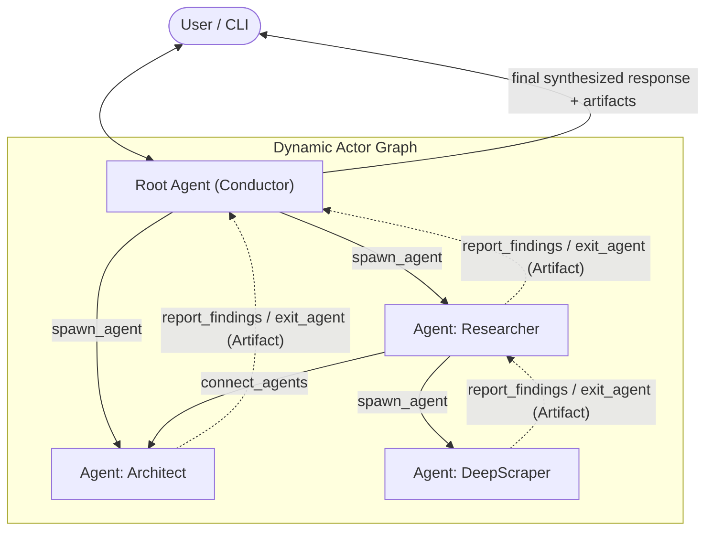

# Multi-Agent Topology & Consensus Protocol

OpenJarvis operates as a **hierarchical, dynamic Multi-Agent System (MAS)**. Rather than relying on a single static routing chain, tasks are executed across a dynamic graph of autonomous **Conductor** agents coordinated via an asynchronous actor engine.

---

## Architecture & Communication Graph

---

## Multi-Agent Meta-Tools

Agents coordinate through four primary meta-tools exposed directly into each Conductor's tool registry:

### 1. `spawn_agent`
Spawns a subordinate agent to tackle a specialized sub-task:
- **Default Hierarchy**: An edge between the spawner and spawnee is created automatically.
- **Role Profiles**: Spawns can reference pre-configured profiles from `config.yaml` (`researcher`, `coder`, `math`, `planner`) or declare ad-hoc roles with custom objectives.
- **Safety Bounds**: Rejects requests that exceed `max_spawn_depth` or `max_active_agents`.

### 2. `connect_agents`
Wires communication edges between any two agents in the graph:
- Enables cross-team collaboration (e.g. connecting a `coder` directly with an active `researcher`).

### 3. `report_findings` (Consensus Mechanism)
Enables peer-to-peer consensus across graph neighbors:
- Agents broadcast significant evidence, calculations, or milestones to their connected neighbors.
- Neighbors receive these findings in their actor queues and incorporate them into their ongoing turns.

### 4. `exit_agent` (Strict Bottom-Up Lifecycle)
Concludes an agent's assignment and emits its deliverable:
- **Strict Bottom-Up Constraint**: An agent **cannot** exit while any child agent it spawned remains active. Parents must wait for their children to finish and deliver their artifacts.
- **Artifact Emission**: Upon exit, the agent generates a structured `AgentArtifact` (Markdown report, code patch, or data JSON).
- **Neighbor Broadcast**: The exit artifact is automatically forwarded to all connected neighbor agents and saved to `.openjarvis/artifacts/`.

---

## Root Agent & User Interaction

The **Root Agent** is the persistent coordinator of the multi-agent graph:
1. **User Communication**: Directly receives user prompts and determines the orchestration strategy.
2. **Supervision**: Spawns specialist workers, monitors incoming findings, and handles edge connections.
3. **Turn Completion**: When all child agents have completed and exited, the Root Agent synthesizes their artifacts and calls `complete_task` to deliver the final response and deliverables to the user.
