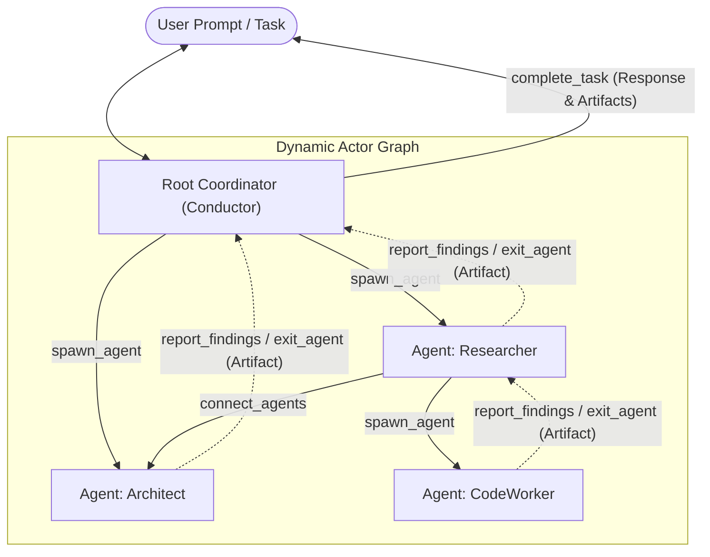
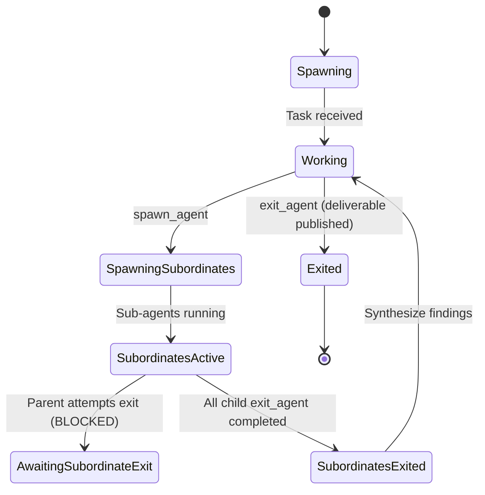

# Multi-Agent Topology & Consensus Protocol

OpenJarvis operates as a hierarchical, dynamic Multi-Agent System (MAS). Complex tasks are resolved across a directed graph of autonomous **Conductor** actor nodes coordinated via an asynchronous message-passing engine.

---

## 1. Actor Architecture & Topology Graph



---

## 2. The 5 Coordination Meta-Tools

All agent conductor nodes are provisioned with engine-level meta-tools that manipulate the graph topology, exchange messages, and regulate lifecycle transitions:

### 1. `spawn_agent`
Instantiates a new subordinate Conductor actor node in the graph:
- **Parameters**:
  - `role` (string, required): Profile name (e.g. `researcher`, `coder`, `math`, `planner`) or custom role identifier.
  - `task` (string, required): Task description and deliverables expectation for the spawned agent.
  - `agent_id` (string, optional): Unique node identifier. Auto-generated if omitted.
  - `connect_to` (list[string], optional): Additional agent IDs to link with in the graph.
- **Topology Behavior**: A directed edge is automatically created between the spawner and the spawned node.
- **Constraints**: Rejects invocations exceeding `limits.max_spawn_depth` or `limits.max_active_agents`.

### 2. `connect_agents`
Creates a bidirectional communication channel between two nodes:
- **Parameters**:
  - `target_agent_id` (string, required): ID of the node to link with.
- **Behavior**: Permits direct peer-to-peer message and findings transmission between siblings or cross-branch nodes.

### 3. `report_findings`
Dispatches intermediate findings, computational results, or status notifications to connected neighbors:
- **Parameters**:
  - `summary` (string, required): High-level summary of the finding or milestone.
  - `details` (string | dict, optional): Detailed data, code snippets, diffs, or structured payloads.
  - `target_neighbors` (list[string], optional): Target recipient subset. Broadcasts to all connected neighbors if omitted.
- **Consensus Behavior**: Neighbors ingest reports into their mailboxes, allowing ongoing turns to incorporate peer findings.

### 4. `exit_agent` (Non-Root Agents)
Terminates a worker node and registers its final deliverables:
- **Parameters**:
  - `summary` (string, required): Summary of accomplished objectives.
  - `artifact` (string | dict, required): Final deliverable payload (code, report, structured JSON).
  - `artifact_type` (string, optional): One of `markdown`, `code`, `json`, `text`. Default: `markdown`.
- **Bottom-Up Exit Enforcement**: Rejects termination if any child agent spawned by this node remains active.
- **Artifact Ingestion**: Saves deliverable to `ArtifactStore` (SHA-256 CAS) and broadcasts exit notifications to all connected neighbors.

### 5. `complete_task` (Root Coordinator Only)
Concludes the execution graph and returns the final synthesized response to the user:
- **Parameters**:
  - `reply` (string, required): Final synthesized textual response.
  - `artifact` (string | dict, optional): Synthesized deliverable artifact.
  - `artifact_type` (string, optional): Format of the deliverable (`markdown`, `code`, `json`, `text`).
- **Graph Invariant**: Blocked if any child agents remain active. The root coordinator must await the exit of all subordinate nodes before concluding.

---

## 3. Asynchronous Actor Engine & Mailboxes

1. **Isolation**: Each `AgentNode` maintains a private `AgentMailbox` running an independent Conductor instance.
2. **Envelope Processing**: Messages are encapsulated within typed `Envelope` structures:
   - `task_assignment`: Initial task payload on spawn.
   - `peer_message`: Direct inter-agent communication.
   - `findings_report`: Milestone broadcasts sent via `report_findings`.
   - `agent_exit`: Termination notifications carrying artifact references.
   - `consensus_request` & `consensus_vote`: Distributed coordination proposals.
3. **Turn Execution**: An actor consumes pending mail, executes LLM generation and tool dispatches up to `max_agent_turns`, and emits state change events.

---

## 4. Strict Bottom-Up Exit Invariant

The engine strictly enforces a bottom-up lifecycle:



If a parent attempts to exit while child nodes are still running:
```json
{"status": "blocked", "message": "Cannot exit yet: child agents ['agent-coder-1'] are still active."}
```
The parent must wait until the child finishes, emits `exit_agent`, and delivers its artifact.
